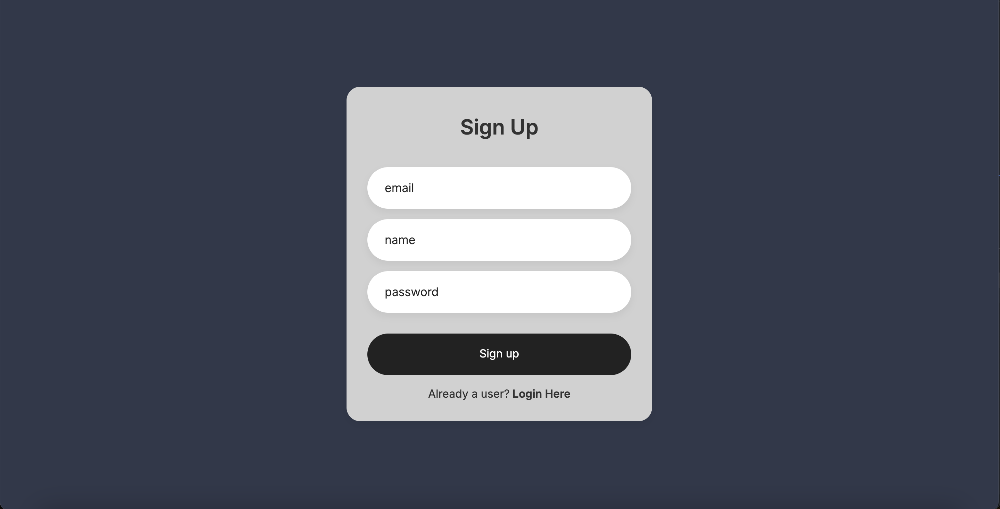

# Productivity Application

## Project Description

This is a full-stack productivity application built using PostgreSQL, Express.js, React and Node.js. The application allows users to add, delete, and manage tasks with a customizable timer feature for productivity. It includes login/registration and secure authentication using JSON Web Tokens (JWT).

## Features

- User authentication with JWT
- Add, delete, and manage tasks
- Timer functionality to enhance productivity
- Secure API endpoints
- View history of study sessions

## Screenshots

### Homepage


### Settings


### Login and Registration




## Technologies Used

- PostgreSQL: Database
- Express.js: Backend framework
- React: Frontend library
- Node.js: Backend runtime environment
- JSON Web Tokens (JWT): Authentication

## Installation

### Prerequisites

Ensure you have the following installed on your local machine:

- Node.js
- PostgreSQL
- Git

### Getting Started

To run the application locally, follow these steps:

#### Clone the repository:

```bash
git clone https://github.com/your-username/productivity-app.git
cd productivity-app
```

#### Install server dependencies

```bash
cd server
npm install
```

#### Install client dependencies

```bash
cd ../client
npm install
```

#### Set up environment variables:

Create a .env file in the server directory with the following variables:
env
JWT_SECRET=your_jwt_secret_here
POSTGRES_PASSWORD=your_postgres_password_here
Ensure not to commit this file to version control by adding it to .gitignore.

#### Start the server

```bash
cd ../server
npm start
```

#### Start the client (in a separate terminal)

```bash
cd ../client
npm start
```

#### Access the application:

Open your browser and navigate to http://localhost:3000 to use the Productivity Application.
